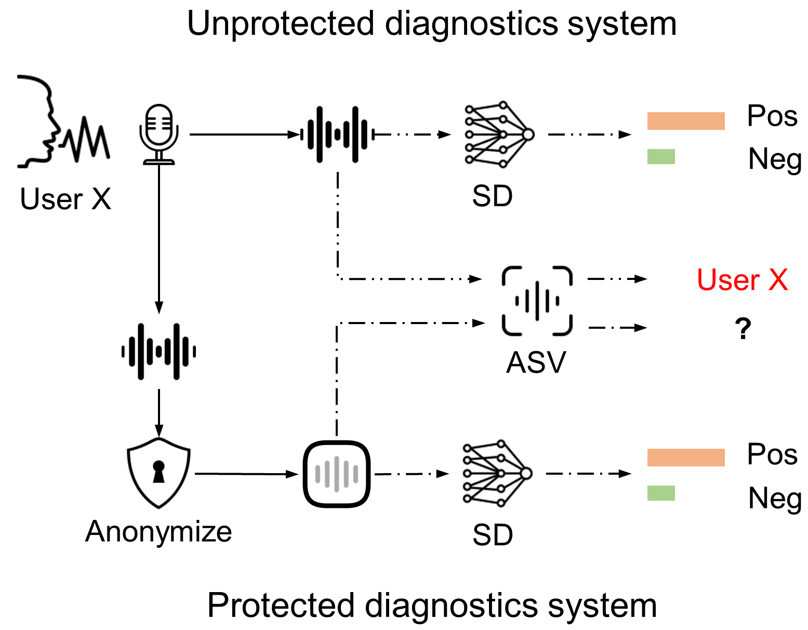

# Overview
This repository contains scripts to reproduce results shown in our paper "On the impact of voice anonymization on speech-based COVID-19 detection". Note that the repo is still in progress and only the voice demos are provided at this stage.

## Demo audio
We provide three versions of the voice recording, including the original voice, the McAdams-anonymized version, and the GAN-anonymized version. To keep the privacy of participants in the COVID-19 datasets employed in our study, the voice demo is from one of our authors. The speech content remains the same as that used in the COVID sound databases.

Original:
https://user-images.githubusercontent.com/48067384/229263325-365843f4-d59e-46e0-9e53-8e9d10a0b22a.mp4

## ASD system diagram




## Repository structure

```bash
├── Config
├── Graphs
├── Local
│   ├── ASV
│   ├── Anonymization
│   ├── Diagnostics
│   └── FE
└── Results
```

**Config**: contains the (hyper-)parameters used for feature extraction, and model training and evaluation. <br /> 

**Local**: contains four sub-folders, corresponding to the four blocks of ASD. All scripts can be found in this folder.  <br /> 
 - **ASV**: speaker-verification systems used to check the efficacy of anonymization. <br />
 - **Anonymization**: anonymization techniques (systems) used to anonymize speech recordings. <br />
 - **Diagnostics**: speech-based diagnostics systems. <br /> 
 - **FE**: feature extraction block, which is comprised of low-level signal processing functions, audio file I/O functions, etc. <br />   

**Results**: results of experiments. <br /> 
**Graphs**: diagrams and so on.
