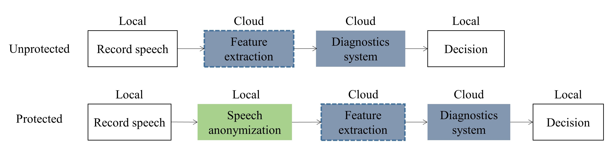

# Anonymized-speech-diagnostics (ASD)
Integrate speech anonymization techniques with speech-based diagnostics systems

## What is ASD

*PLACEHOLDER FOR BACKGROUND*

## ASD system diagram

*PLACEHOLDER FOR GRAPHS*



## Training and inference phase of ASD

*PLACEHOLDER FOR GRAPHS*

## Repository structure

```bash
├── Config
├── Graphs
├── Local
│   ├── ASV
│   ├── Anonymization
│   ├── Diagnostics
│   └── FE
└── Results
```

**Config**: contains the (hyper-)parameters used for different models. <br /> 

**Local**: contains four sub-folders, corresponding to the four blocks of ASD. All scripts can be found in this folder.  <br /> 
 - **ASV**: speaker-verification systems used to check the efficacy of anonymization. <br />
 - **Anonymization**: anonymization techniques (systems) used to anonymize speech recordings. <br />
 - **Diagnostics**: speech-based diagnostics systems. <br /> 
 - **FE**: feature extraction block, which is comprised of low-level signal processing functions, audio file I/O functions, etc. <br />   

**Results**: results of experiments. <br /> 
**Graphs**: diagrams and so on.